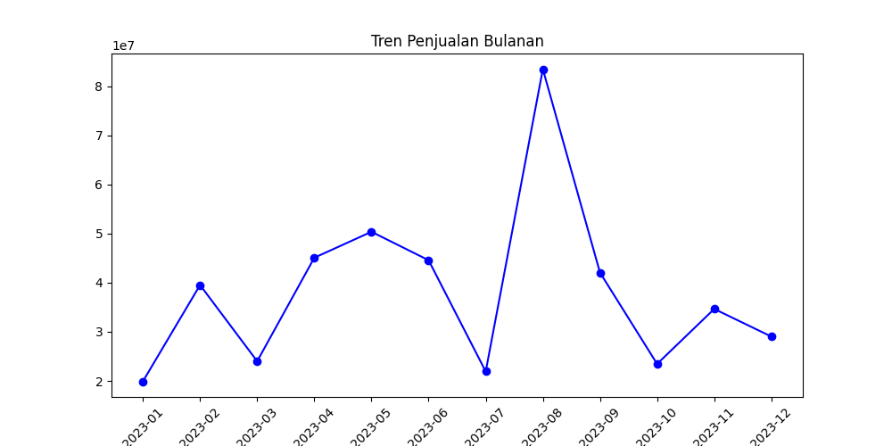
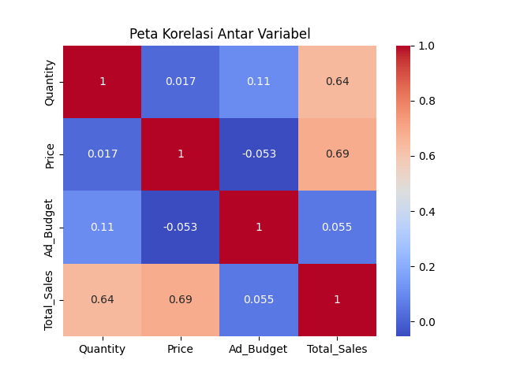

# 📊 Analisis Performa Penjualan E-commerce

[](https://www.python.org/)
[](https://pandas.pydata.org/)
[]()

Laporan ini disusun sebagai bagian dari praktikum analisis data untuk mengidentifikasi performa penjualan, segmentasi pelanggan, dan efisiensi strategi pemasaran pada platform e-commerce.

---

## 🎯 1. Business Question
Analisis ini bertujuan untuk menjawab permasalahan bisnis berikut:
* [cite_start]**Produk Underperformer:** Mengidentifikasi produk dengan harga tinggi namun volume penjualan rendah[cite: 1].
* [cite_start]**Segmentasi Pelanggan:** Menentukan pelanggan prioritas untuk program loyalitas menggunakan metode **RFM (Recency, Frequency, Monetary)**[cite: 1].
* [cite_start]**Efisiensi Kategori:** Mengevaluasi perbandingan pendapatan kategori terhadap anggaran iklan yang dihabiskan[cite: 1].
* [cite_start]**Analisis Prediktif:** Menguji pengaruh biaya iklan terhadap total penjualan melalui model regresi linear[cite: 1].

---

## 🛠️ 2. Data Wrangling
Tahapan pembersihan data dilakukan untuk memastikan validitas hasil analisis:
1. [cite_start]**Inspeksi Data:** Mengecek tipe data dan nilai yang hilang menggunakan `df.info()`[cite: 1].
2. [cite_start]**Pembersihan Anomali:** Menghapus entri dengan harga negatif atau nol (`Price > 0`)[cite: 1].
3. [cite_start]**Standarisasi Waktu:** Mengonversi kolom `Order_Date` menjadi format *datetime* untuk analisis tren dan waktu[cite: 1].

---

## 📈 3. Insights (Temuan Utama)

### A. Tren Penjualan Bulanan
Berdasarkan grafik tren di bawah ini, kita dapat melihat pola fluktuasi penjualan sepanjang tahun 2023. Puncak penjualan tertinggi (peak season) terjadi pada bulan **Agustus**, yang mencapai lebih dari 80 juta unit penjualan.



*(Catatan: Ganti URL gambar di atas dengan path file gambar Anda di repository, contoh: ./images/tren_penjualan.png)*

### B. Korelasi Antar Variabel
Melalui *Heatmap* korelasi, ditemukan beberapa poin penting:
* **Total Sales & Price:** Memiliki korelasi positif yang cukup kuat (**0.69**), menunjukkan harga produk berkontribusi signifikan terhadap nilai total penjualan.
* **Total Sales & Quantity:** Memiliki korelasi positif sebesar **0.64**.
* **Ad Budget:** Menariknya, anggaran iklan menunjukkan korelasi yang sangat rendah terhadap total penjualan (**0.055**) pada dataset ini, yang mengindikasikan perlunya optimasi strategi iklan.



*(Catatan: Ganti URL gambar di atas dengan path file gambar Anda di repository, contoh: ./images/heatmap_korelasi.png)*

---

## 💡 4. Recommendation
Berdasarkan hasil analisis, langkah strategis yang direkomendasikan adalah:
* [cite_start]**Optimasi Stok:** Melakukan penyesuaian harga atau promosi untuk kategori produk *underperformer*[cite: 1].
* [cite_start]**Program Loyalitas:** Memberikan voucher eksklusif kepada pelanggan di segmen skor RFM tertinggi (R5, F5, M5)[cite: 1].
* **Evaluasi Iklan:** Mengingat korelasi iklan yang rendah, perusahaan perlu melakukan audit kreatif atau target audiens agar `Ad_Budget` memberikan dampak lebih besar pada `Total_Sales`.
* **Strategi Peak Season:** Mempersiapkan stok dan kampanye lebih besar menjelang bulan Agustus berdasarkan data tren sejarah.

---

## 💻 5. Implementasi Kode (Snippet)

### Analisis RFM
```python
# Agregasi data RFM [cite: 1]
rfm = df.groupby('CustomerID').agg({
    'Order_Date': lambda x: (snapshot_date - x.max()).days, # Recency
    'Order_ID': 'count',                                   # Frequency
    'Total_Sales': 'sum'                                   # Monetary
})